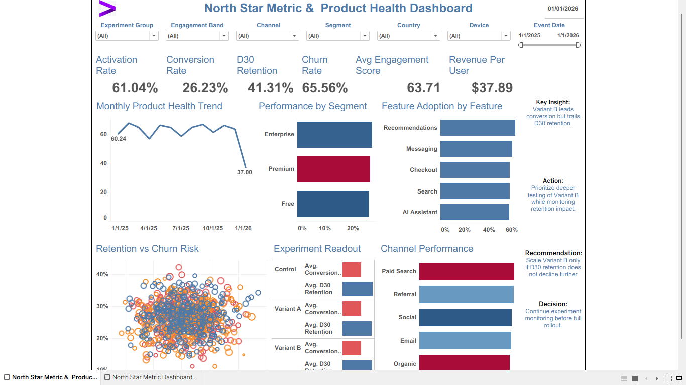

# North Star Metric & Product Health Dashboard



## Executive Summary

This project is a **North Star Metric & Product Health Dashboard** built for a Data Analyst / Product Analytics portfolio. It monitors activation, conversion, retention, churn, engagement, revenue per user, experiment performance, channel performance, segment health, and feature adoption.

The dashboard is designed to show a real-world decision-support workflow: **product health monitoring → KPI diagnosis → experiment readout → recommendation → product decision**.

## Business Problem

Product and growth teams need one executive view that answers:

- Are users activating and converting?
- Are users retaining after 30 days?
- Which segments and channels are driving product health?
- Which experiment group performs best?
- Which product features are being adopted?
- Should Variant B be scaled or monitored longer?

## KPI Goals

| KPI | Goal |
|---|---|
| Activation Rate | Measure successful early product engagement |
| Conversion Rate | Track movement from engagement to desired action |
| D30 Retention | Measure long-term user value and product stickiness |
| Churn Rate | Identify user loss risk |
| Avg Engagement Score | Monitor behavioral product health |
| Revenue Per User | Connect product behavior to monetization |
| Feature Adoption Rate | Identify which product features drive usage |

## Dataset

- Rows: **920**
- Date range: **2025-01-01 to 2026-01-01**
- Grain: **user-level product health record**
- Core dimensions: country, segment, device, acquisition channel, feature used, experiment group, engagement band
- Core metrics: DAU, WAU, MAU, stickiness, activation, conversion, D1/D7/D30 retention, churn, revenue per user, session frequency, feature adoption, engagement score

## Dashboard KPIs

| Metric | Value |
|---|---:|
| Activation Rate | 61.04% |
| Conversion Rate | 26.23% |
| D30 Retention | 41.31% |
| Churn Rate | 65.56% |
| Avg Engagement Score | 63.71 |
| Revenue Per User | $37.89 |

## SQL Transformations

SQL scripts are included in the `sql/` folder for:

- product health KPI aggregation
- segment performance analysis
- experiment readout
- channel performance
- feature adoption
- retention and churn risk monitoring

## Metrics Engineering

This project treats metrics as reusable business definitions rather than one-off calculations.

Example definitions:

```text
Activation Rate = average users completing meaningful early engagement behavior
Conversion Rate = average users completing the target conversion action
D30 Retention = average users retained 30 days after activation/acquisition
Churn Rate = average users showing churn behavior
Revenue Per User = average revenue generated per user
Feature Adoption Rate = average adoption level by primary feature used
```

## Analytics Workflow

1. Load product health dataset
2. Clean and validate user-level records
3. Aggregate KPIs by month, segment, channel, feature, and experiment group
4. Build Tableau dashboard views
5. Add insight/action/recommendation/decision text blocks
6. Use Streamlit for an interactive portfolio companion app

## Product Insights

### Insight 1: Variant B leads conversion but trails D30 retention
Variant B shows stronger conversion performance, but the decision should not be based on conversion alone because retention is the stronger product-health signal.

### Insight 2: Retention risk is still high
The dashboard shows a gap between activation and D30 retention, meaning users may start strong but do not consistently return long term.

### Insight 3: Channel quality should be monitored beyond acquisition
Paid Search and Referral should be compared not only by conversion but also by D30 retention and revenue per user.

### Insight 4: Feature adoption is concentrated in key product areas
Recommendations, Messaging, Checkout, Search, and AI Assistant should be monitored to identify which features create repeated engagement.

## Experimentation Thinking

This dashboard uses experiment groups to compare product outcomes across Control, Variant A, and Variant B.

Primary metric:

- Conversion Rate

Guardrail metrics:

- D30 Retention
- Churn Rate
- Revenue Per User

Decision logic:

```text
If Variant B improves conversion and D30 retention does not decline, scale Variant B.
If Variant B improves conversion but retention declines, continue monitoring before rollout.
If Variant B does not improve conversion or retention, do not ship.
```

## Recommendations

1. Continue monitoring Variant B before full rollout.
2. Prioritize deeper testing on users with medium engagement scores.
3. Track D30 retention as the main guardrail metric.
4. Compare channel quality using conversion + retention + revenue per user, not conversion alone.
5. Use feature adoption trends to identify where product improvements can increase repeat engagement.

## Decision Framework

| Decision Area | Recommendation |
|---|---|
| Experiment rollout | Continue monitoring Variant B before full rollout |
| Retention strategy | Improve D30 retention before aggressive scaling |
| Channel investment | Prioritize channels with strong conversion and retention |
| Feature strategy | Invest in features with high adoption and engagement impact |
| Executive decision | Treat retention as the main product-health guardrail |

## Business Impact

This project shows how product analytics can support executive product decisions by connecting:

- user behavior
- retention risk
- experiment performance
- feature adoption
- monetization
- decision-making

Expected business value:

- Better experiment rollout decisions
- Improved retention monitoring
- Stronger product health visibility
- Clearer channel and segment prioritization
- More executive-ready dashboard storytelling

## Streamlit App

Run the portfolio app locally:

```bash
pip install -r requirements.txt
streamlit run app/streamlit_app.py
```

## Repo Architecture

```text
north-star-product-health-dashboard/
│
├── data/
│   ├── nsm_product_health_data.csv
│   ├── segment_summary.csv
│   ├── experiment_readout_summary.csv
│   ├── channel_performance_summary.csv
│   └── feature_adoption_summary.csv
│
├── sql/
│   ├── 01_product_health_kpis.sql
│   ├── 02_segment_performance.sql
│   ├── 03_experiment_readout.sql
│   ├── 04_channel_performance.sql
│   └── 05_feature_adoption.sql
│
├── notebooks/
│   ├── 01_eda.ipynb
│   └── 02_kpi_analysis.ipynb
│
├── dashboard/
│   └── tableau_dashboard_placeholder.txt
│
├── screenshots/
│   └── nsm_product_health_dashboard.png
│
├── app/
│   ├── streamlit_app.py
│   ├── components.py
│   └── utils.py
│
├── docs/
│   ├── business_case.md
│   ├── dashboard_guide.md
│   ├── kpi_definitions.md
│   └── decision_framework.md
│
├── requirements.txt
├── .gitignore
└── README.md
```

## Automation Awareness

This repo can be extended with:

- scheduled SQL refresh jobs
- Python data validation scripts
- Streamlit Cloud deployment
- Tableau extract refresh automation
- Prefect pipeline orchestration for portfolio-level maturity

## Future Improvements

- Add statistical significance testing for experiment readout
- Add retention cohort heatmap
- Add Bayesian experiment probability-to-win
- Add CUPED-adjusted experiment metrics
- Add SHAP-based churn-risk explanation
- Deploy the Streamlit app publicly
